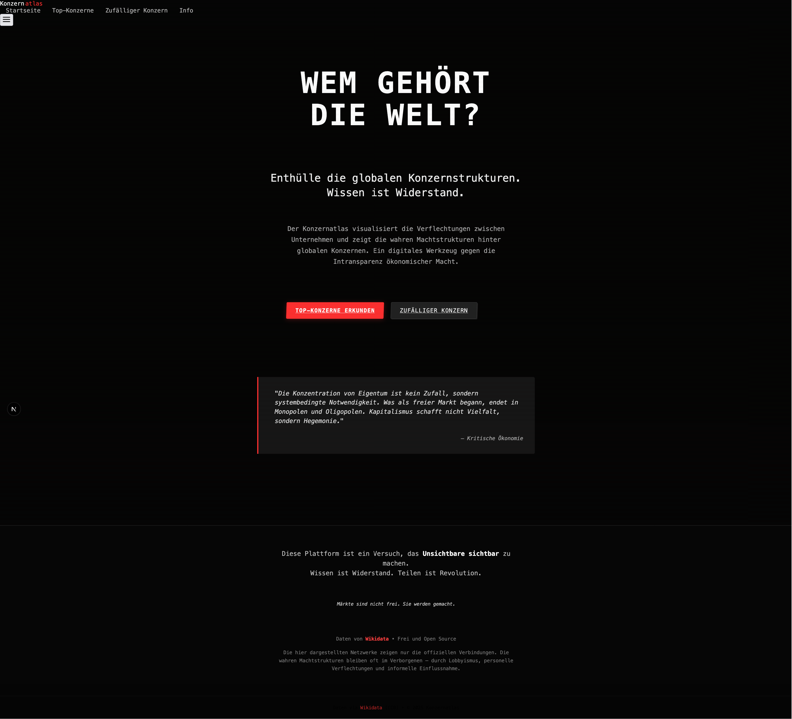
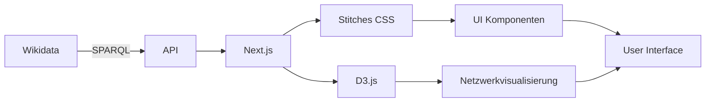

<div align="center">

# KONZERNATLAS


### WEM GEHÖRT DIE WELT?

_Ein digitales Werkzeug gegen die Intransparenz ökonomischer Macht_

[](https://github.com/ttvtimotheus/konzernatlas/blob/main/LICENSE)
[](https://query.wikidata.org/)
[](https://nextjs.org/)
[](https://stitches.dev/)
[](https://d3js.org/)

</div>

## 🔍 ÜBER DAS PROJEKT

**Konzernatlas** visualisiert die verborgenen Verflechtungen zwischen globalen Konzernen und deckt die wahren Machtstrukturen hinter den größten Unternehmen der Welt auf. Das Projekt verfolgt einen dezidiert **kapitalismuskritischen Ansatz**, indem es ökonomische Konzentrationsprozesse sichtbar macht und zur kritischen Auseinandersetzung mit Eigentumsstrukturen anregt.

> "Die Konzentration von Eigentum ist kein Zufall, sondern systembedingte Notwendigkeit. Was als freier Markt begann, endet in Monopolen und Oligopolen. Kapitalismus schafft nicht Vielfalt, sondern Hegemonie."

## ✨ KERNFUNKTIONEN

- **Transparent** — Visualisierung komplexer Konzernverflechtungen in Echtzeit
- **Netzwerkzentriert** — Interaktive Graphdarstellung von Eigentumsverhältnissen
- **Datenbasiert** — Nutzung strukturierter Open Data von Wikidata
- **Kritisch** — Offenlegung von Machtkonzentrationen und ökonomischen Abhängigkeiten
- **Zugänglich** — Intuitive Benutzeroberfläche für alle Zielgruppen

## 🔮 DEMO

Besuchen Sie [konzernatlas.de](https://konzernatlas.de), um die Live-Version zu erkunden.

<div align="center">

</div>

## 🛠️ TECHNOLOGIE



- **Framework:** Next.js (App Router) mit TypeScript
- **Styling:** Stitches + Radix UI für kapitalismuskritisches Design
- **Datenvisualisierung:** D3.js für interaktive Graphen
- **Datenquelle:** Wikidata SPARQL Endpoint
- **Deployment:** Vercel

## 🚀 INSTALLATION

```bash
# Repository klonen
git clone https://github.com/ttvtimotheus/konzernatlas.git

# Projektverzeichnis wechseln
cd konzernatlas

# Abhängigkeiten installieren
npm install

# Entwicklungsserver starten
npm run dev
```

Öffnen Sie [http://localhost:3000](http://localhost:3000) in Ihrem Browser, um die lokale Entwicklungsversion zu sehen.

## 🧪 VERWENDUNG

1. **Suchen** — Namen eines Unternehmens eingeben
2. **Auswählen** — Passenden Treffer aus den Vorschlägen wählen
3. **Erkunden** — Besitzverhältnisse im interaktiven Netzwerkgraphen analysieren
4. **Interagieren** — Durch Hover, Zoom und Drag die Verflechtungen entdecken
5. **Teilen** — Einzigartige URL für jedes Unternehmensnetzwerk weitergeben

## 📊 DATENMODELL

Das Projekt nutzt ein komplexes SPARQL-Abfragemodell, um Unternehmensverflechtungen direkt von Wikidata abzurufen:

```sparql
SELECT ?company ?companyLabel ?parentCompany ?parentCompanyLabel ?percentOwned ?country ?countryLabel ?industry ?industryLabel
WHERE {
  # Basis-Informationen zum Unternehmen
  VALUES ?company { wd:Q380 } # Beispiel: Amazon
  ?company wdt:P31/wdt:P279* ?type .
  VALUES ?type { wd:Q783794 wd:Q4830453 } # Unternehmen/Business
  
  # Besitzverhältnisse finden
  ?company wdt:P127 ?parentCompany .
  OPTIONAL { ?company wdt:P1198 ?percentOwned . }
  
  # Zusätzliche Metadaten
  OPTIONAL { ?company wdt:P17 ?country . }
  OPTIONAL { ?company wdt:P452 ?industry . }
  
  # Labels für alle Entitäten
  SERVICE wikibase:label { bd:serviceParam wikibase:language "[AUTO_LANGUAGE],en,de". }
}
```

## 📝 BEITRAGEN

Beiträge sind willkommen! Um zum Projekt beizutragen:

1. Forken Sie das Repository
2. Erstellen Sie einen Feature-Branch (`git checkout -b feature/AmazingFeature`)
3. Committen Sie Ihre Änderungen (`git commit -m 'Add: Amazing Feature'`)
4. Pushen Sie den Branch (`git push origin feature/AmazingFeature`)
5. Öffnen Sie einen Pull Request

## 📜 PHILOSOPHIE

Der Konzernatlas folgt in seiner Konzeption und Gestaltung einer klaren **kapitalismuskritischen Perspektive**. Das Projekt versteht sich als Beitrag zur Aufklärung über verborgene ökonomische Machtstrukturen und will:

- **Sichtbar machen**, was sonst verborgen bleibt
- **Bewusstsein schaffen** für Konzentrationsprozesse im globalen Kapitalismus
- **Zugänglich machen**, was normalerweise hinter komplexen Datenstrukturen verschwindet
- **Ermächtigen** durch Wissen über reale Machtverteilungen

> Wissen ist Widerstand. Teilen ist Revolution.
> 
> Märkte sind nicht frei. Sie werden gemacht.

## 📄 LIZENZ

Dieses Projekt ist unter der MIT-Lizenz veröffentlicht. Siehe [LICENSE](./LICENSE) für Details.

## 🙏 DANKSAGUNG

- **Wikidata** für den freien Zugang zu strukturierten Daten
- **D3.js** für die mächtige Visualisierungsbibliothek
- **Next.js** für das innovative Reaktionsnetz-Framework
- **Stitches/Radix UI** für die flexiblen Styling-Möglichkeiten
- **Der kritischen Netzgemeinde** für Feedback und Unterstützung

<div align="center">
<sub>© 2025 Konzernatlas — Ein Projekt von Timotheus Haseloff</sub>
</div>

